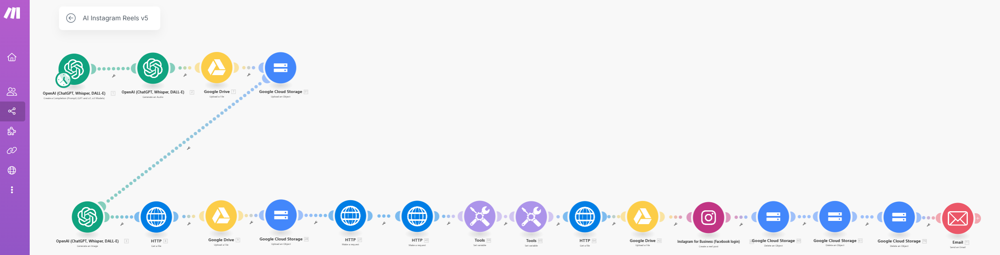

# Complete Guide: Automating AI-Powered Instagram Reels with Make.com, OpenAI, and Google Cloud



## Introduction
This detailed guide walks you step-by-step through setting up and launching a **pre-configured Make.com workflow** that automatically generates and publishes Instagram Reels using just a text prompt. The workflow is provided as a **JSON file** and only needs to be **imported** into Make.com, then configured properly.

We will use:
- **Make.com** to orchestrate the automation
- **OpenAI** to generate text, audio, and images
- **Google Drive** to store backup files
- **Google Cloud Storage (GCS)** as hosting for Cloud Run
- **Google Cloud Run** to merge the PNG image and MP3 audio into an MP4 video

---

## 🧭 How to Use Make.com (Beginner Guide)
### What is Make.com?
Make.com is a no-code automation platform similar to Zapier, but far more flexible and powerful. It allows you to build automation flows (scenarios) composed of connected modules. Each module performs a task: uploading a file, sending an API request, processing data, and so on.

### Key Concepts:
- **Scenario:** the automation flow
- **Module:** a building block that performs an action (e.g., generate audio, upload to Drive)
- **Variable/Output:** the result from a module that can be used in another one (drag & drop)

### Importing the Workflow JSON
1. Go to [make.com](https://www.make.com)
2. Log in (or sign up)
3. Navigate to "Scenarios"
4. Click "Import scenario"
5. Upload the `.json` file provided (e.g., `workflow-ai-reels.json`)
6. Open the imported scenario — all modules will be pre-connected
7. Proceed with **configuring each module** (authentication and field values)

### Connecting Accounts (Authentication)
For each module (e.g., OpenAI, Google Drive), click **"Add" or "Connect"** and:
- Enter your API key (for OpenAI)
- Provide OAuth credentials (for Google)
- Authorize account access (a pop-up window will appear)

If a module doesn’t show output, click “Run once” to test it manually.

---

## 🧱 How to Configure Google Cloud Platform (GCP) — Step-by-Step
### 1. Create a GCP Project
1. Go to [console.cloud.google.com](https://console.cloud.google.com/)
2. Click "Project" (top left) > "New Project"
3. Name your project (e.g., `makecom-reels`)
4. Save and wait for it to finish creating

### 2. Enable Required APIs
Go to:
- Menu > "APIs & Services" > "Library"
  - Search and enable:
    - **Cloud Resource Manager API**
    - **Cloud Pub/Sub API**
    - **Cloud Run API**
    - **Google Drive API**
    - **Cloud Storage API**

### 3. Create a Google Cloud Storage Bucket
1. Menu > "Storage" > "Browser"
2. Click “Create Bucket”
3. Name it: `makecom-reels`
4. Region: Multi-region – Europe
5. Access: Make public (optional but helpful)
6. Click Create

### 4. Create an OAuth Client (Google Drive + GCS)
1. Menu > APIs & Services > **OAuth Consent Screen**
   - User type: External
   - App name: `makecom-pr-client`
   - Developer email: your own
   - Authorized domains:
     - `https://make.com`
     - `https://integromat.com`
     - `https://www.googleapis.com`
   - Save

2. Menu > **Credentials** > "Create credentials" > "OAuth client ID"
   - Application type: Web App
   - Name: `makecom-pr-client`
   - Redirect URIs:
     - `https://www.integromat.com/oauth/cb/google-custom`
   - Save and **copy Client ID and Client Secret**

3. Paste your Client ID/Secret into Make.com when configuring Google Drive or GCS modules.

---
## 🔁 Full Workflow – Step-by-Step Instructions

This section explains each automation step from the pre-configured Make.com scenario. Each step corresponds to a module in the workflow.

### Step 1: Generate Text with OpenAI (GPT-4o)
- **Module**: OpenAI – Chat Completion
- **Model**: gpt-4o
- **Purpose**: Generate a short, spoken-style script for a Reel
- **Prompt example**:
  ```
  Write a short, engaging script for an Instagram Reel about X
  ```

### Step 2: Convert Text to Voice (TTS)
- **Module**: OpenAI – Generate Audio
- **Model**: tts-1
- **Input**: Output from Step 1
- **Output**: MP3 voiceover

### Step 3: Upload MP3 to Google Drive
- **Module**: Google Drive – Upload File
- **Purpose**: Backup the MP3 file
- **OAuth**: Set up via Google Developer Console with redirect URIs
- **Folder**: /MakeCom/AI-reels/

### Step 4: Upload MP3 to GCP Bucket
- **Module**: HTTP – Upload to Google Cloud Storage (via signed URL or Make.com integration)
- **Bucket**: makecom-reels

### Step 5: Generate Image with DALL·E 3
- **Module**: OpenAI – Generate Image
- **Prompt example**:
  ```
  A modern, eye-catching illustration about CyberSeXcurity for a vertical Reel cover.
  Bright, clean, minimalistic – no text or logos.
  ```
- **Size**: 1024x1792 px
- **Style**: Vivid

### Step 6: Get the Image File (URL)
- **Module**: HTTP – Get a File
- **URL**: Use {{3.data[].url}} from the DALL·E response

### Step 7: Upload PNG to Google Drive
- **Module**: Google Drive – Upload File
- **Purpose**: Backup of the generated image

### Step 8: Upload PNG to GCP Bucket
- **Module**: HTTP – Upload (or GCP module)

### Step 9: Merge Audio + Image with Cloud Run
- **Service**: Google Cloud Run (custom Docker image)
- **Tools**: ffmpeg, Flask, gunicorn
- **Required files**: main.py, Dockerfile, requirements.txt

```bash
gcloud builds submit --tag <docker-image-url>
gcloud run deploy video-editor --image <docker-image-url> --platform=managed --region=europe-west3 --allow-unauthenticated
```

**Test endpoint:**
```bash
curl -X POST "https://video-editor-xxxxxx.run.app/process"   -H "Content-Type: application/json"   -d '{"image":"gs://makecom-reels/file.png","audio":"gs://makecom-reels/audio.mp3","output":"gs://makecom-reels/output.mp4"}'
```

### Step 10: Retrieve the Generated Video File
- **Module**: HTTP – Make a Request
- **API**: Google Cloud Storage List Objects
- **URL**: https://www.googleapis.com/storage/v1/b/makecom-reels/o?orderBy=timeCreated
- **Query**:
  - name: prefix
  - value: output-

### Step 11: Upload MP4 to Google Drive
- **Module**: Google Drive – Upload File
- **Purpose**: Backup and easy access to video

### Step 12: Optional – Publish to Instagram (Manual or via API)
Post manually or use third-party schedulers.

### Step 13: Cleanup Temporary Files
- **Module**: HTTP or GCP – Delete Object
- **Files**: file.png, openai-tts-output.mp3, output.mp4
- Add error handling: "Ignore if file doesn’t exist"

### Step 14: Send Email Notification (Optional)
- **Service**: MailerSend SMTP or HTTP API
- **Domain**: trial-xxxxxx.mlsender.net

---
